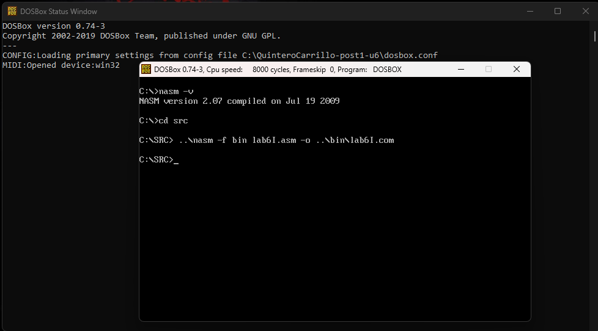
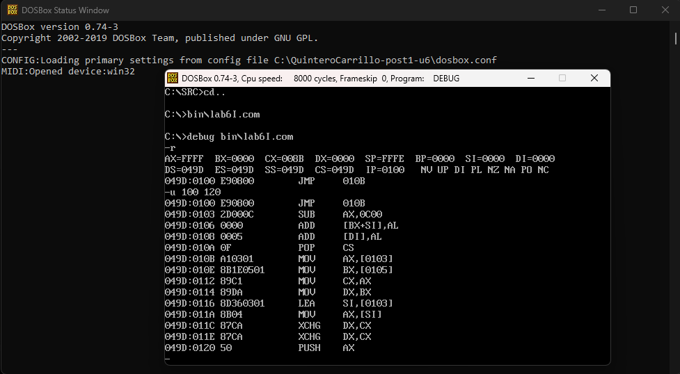
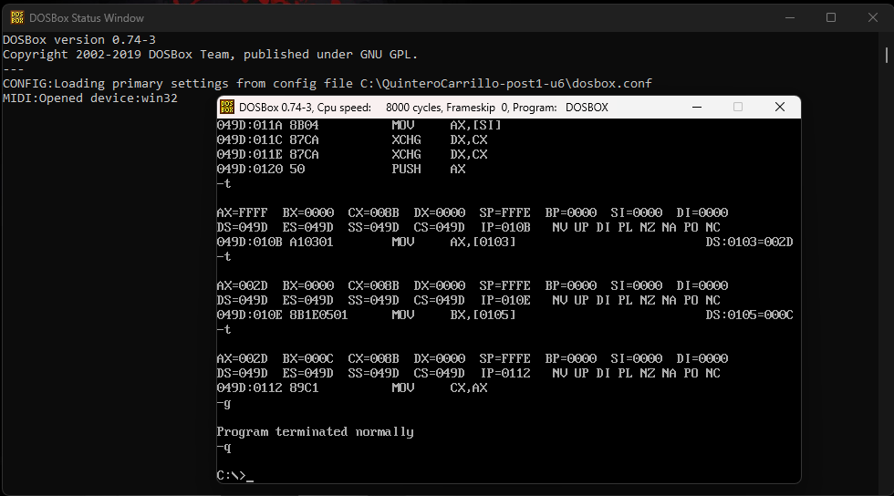
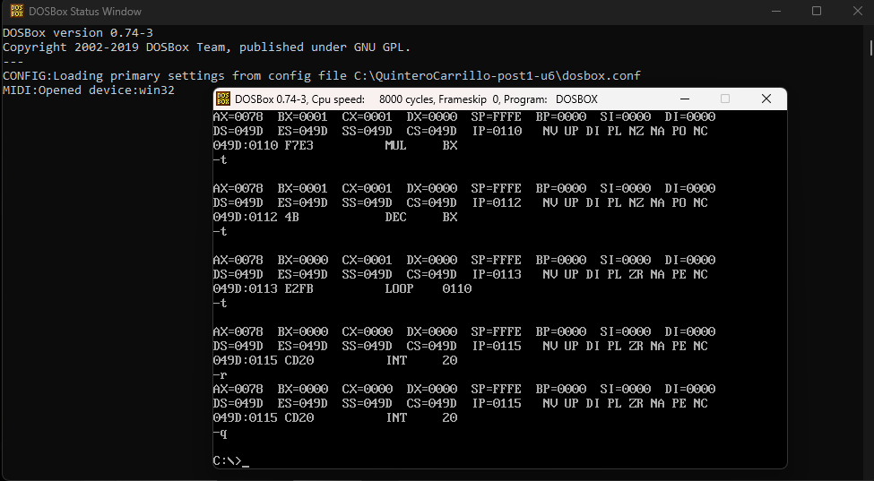

# Laboratorio 6 — Instrucciones Mixtas en NASM x86

**Estudiante:** Neidys Mariana Quintero Carrillo 
**Código:** 1152447
**Curso:** Arquitectura de Computadores  
**Programa:** Ingeniería de Sistemas  
**Universidad:** Francisco de Paula Santander  
**Año:** 2026  

---

## Descripción del laboratorio

Este laboratorio implementa un programa en lenguaje ensamblador NASM para arquitectura x86 que demuestra el uso práctico de las cuatro categorías fundamentales de instrucciones: transferencia de datos, operaciones aritméticas, manipulaciones lógicas y control de flujo con saltos condicionales. El programa se compila y ejecuta en DOSBox, y se verifica el comportamiento de los registros y flags mediante DEBUG.

---

## Entorno utilizado

| Componente | Versión / Detalle |
|---|---|
| Sistema operativo anfitrión | Windows [10/11] |
| DOSBox | 0.74-3 |
| NASM para DOS | 2.07 (Jul 19 2009) |
| CWSDPMI | csdpmi5b |
| Editor de texto | Notepad++ |

---

## Estructura del repositorio
```
QuinteroCarrillo-post1-u6/
├── src/
│   ├── lab6.asm           # Programa principal - instrucciones mixtas
│   └── lab6_factorial.asm # Variante factorial 5! = 120
├── bin/
│   ├── lab6.com           # Ejecutable programa principal
│   └── lab6f.com          # Ejecutable variante factorial
├── capturas/
│   ├── cp1_compilacion.png    # Checkpoint 1: compilacion exitosa
│   ├── cp2_debug_flags.png    # Checkpoint 2: trazado DEBUG con flags
│   └── cp3_factorial.png      # Checkpoint 3: AX=120 factorial
├── dosbox.conf            # Configuracion DOSBox
└── README.md              # Este archivo
```
---

## Descripción de cada bloque del programa

### Bloque 1 — Transferencia de datos
Demuestra el uso de MOV para copiar valores entre registros y memoria, LEA
para cargar direcciones, XCHG para intercambiar registros y PUSH/POP para
preservar valores en la pila. Valores iniciales: valor_a=45, valor_b=12.

### Bloque 2 — Operaciones aritméticas
Implementa ADD (45+12=57), SUB (12-45=-33), INC/DEC, MUL (10×7=70) y
DIV (100÷7: cociente=14, resto=2). Se observan los flags ZF, SF, CF y OF
según el resultado de cada operación.

### Bloque 3 — Operaciones lógicas
Demuestra AND para limpiar bits (0B7h AND 0Fh = 07h), OR para activar bits
(0B7h OR F0h = F7h), XOR para inversión (0AAh XOR FFh = 55h), TEST para
verificar bits sin modificar el operando, y SHL/SHR para desplazamiento.

### Bloque 4 — Control de flujo
Implementa una estructura if/else con CMP y JG/JE para comparar valor_a con
valor_b (resultado: CX=1 porque 45 > 12). Seguido de un bucle con LOOP que
calcula la suma acumulada 1+2+3+4+5 = 15 (AX=000Fh al finalizar).

---

## Tabla de registros y flags observados en DEBUG

| Instrucción | Registro | Valor antes | Valor después | Flags afectados |
|---|---|---|---|---|
| MOV ax, [valor_a] | AX | FFFF | 002D (45) | Ninguno |
| MOV bx, [valor_b] | BX | 0000 | 000C (12) | Ninguno |
| ADD ax, [valor_b] | AX | 002D | 0039 (57) | ZF=0 CF=0 OF=0 |
| SUB ax, [valor_a] | AX | 000C | FFDF (-33) | SF=1 OF=0 |
| MUL bl (10×7) | AX | 000A | 0046 (70) | CF=0 OF=0 |
| DIV bl (100÷7) | AX | 0064 | 020E (AL=14,AH=2) | — |
| AND al, 0Fh | AL | B7 | 07 | ZF=0 SF=0 |
| XOR al, FFh | AL | AA | 55 | ZF=0 SF=0 |
| LOOP .bucle_suma | CX | 0001 | 0000 | ZF=1 |

---

## Variante factorial — Diferencia entre LOOP y DEC/JNZ

### Versión con LOOP (lab6_factorial.asm)
```nasm
MOV ax, 1
MOV cx, 5
MOV bx, 5
.bucle_fact:
    MUL bx
    DEC bx
    LOOP .bucle_fact   ; DEC CX automatico + salto si CX!=0
; AX = 120
```

### Versión equivalente con DEC/JNZ
```nasm
MOV ax, 1
MOV cx, 5
MOV bx, 5
.bucle_fact:
    MUL bx
    DEC bx
    DEC cx             ; decrementar contador manualmente
    JNZ .bucle_fact    ; saltar si CX != 0
; AX = 120
```

### Cuándo usar cada una
LOOP es preferible cuando el contador es simple y se usa CX exclusivamente
como contador, ya que combina DEC CX y JNZ en una sola instrucción de 2 bytes,
siendo más compacta. DEC/JNZ es preferible cuando se necesita usar CX para
otro propósito dentro del bucle, o cuando el contador no es CX, ya que permite
mayor flexibilidad en qué registro se usa como contador.

---

## Capturas del proceso

### Checkpoint 1 — Compilación exitosa


### Checkpoint 2 — Trazado en DEBUG con flags



### Checkpoint 3 — Factorial AX=120


---

## Resultados obtenidos

| Checkpoint | Descripción | Resultado esperado | E
|---|---|---|---|
| CP1 | Compilación sin errores | Sin mensajes de error | 
| CP2 | Trazado DEBUG con flags | AX=57 tras ADD, flags visibles | 
| CP3 | Factorial 5! con MUL+LOOP | AX=0078h (120) |  

---

## Conclusiones

- Las cuatro categorías de instrucciones x86 (transferencia, aritmética, lógica
  y control de flujo) permiten construir programas completos con operaciones
  verificables a nivel de registro mediante el depurador DEBUG.
- Los flags del procesador (ZF, SF, CF, OF) se actualizan automáticamente
  tras operaciones aritméticas y lógicas, y son la base de las estructuras de
  decisión mediante saltos condicionales como JG, JE y JNZ.
- La instrucción LOOP combina DEC CX y JNZ en una sola operación, siendo
  más eficiente para bucles simples, mientras que DEC/JNZ ofrece más
  flexibilidad cuando se necesita otro registro como contador.
